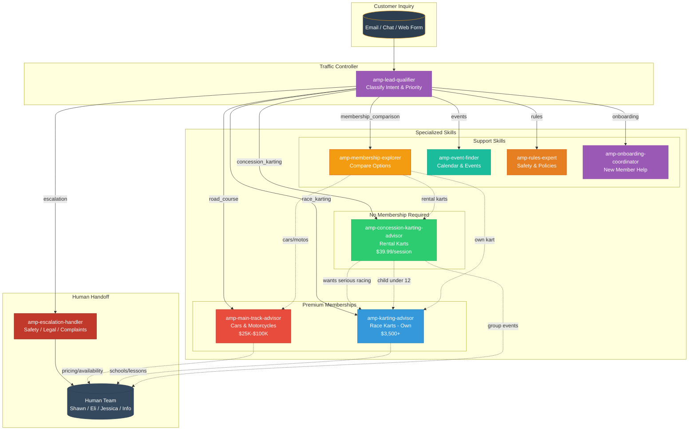
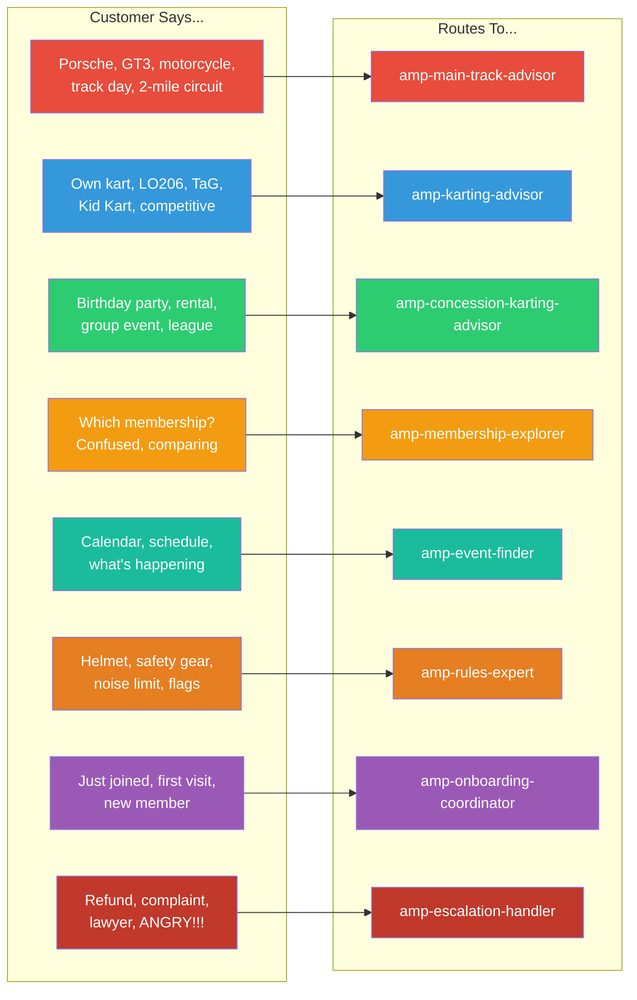
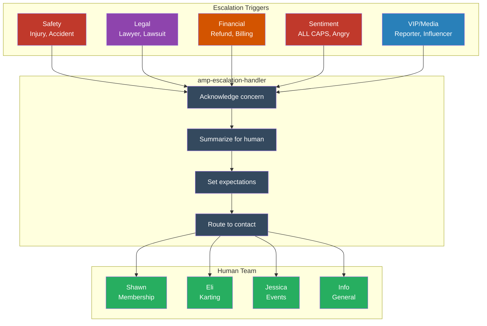

# AMP AI Customer Service Skills

## What This Repository Does
This repository contains modular AI "skills" that power Atlanta Motorsports Park's automated customer service system. Each skill is a specialized knowledge module that helps our AI assistant answer specific types of customer inquiries via email.

**Dual-Purpose Design**: These skills also serve as knowledge bases for **Claude Code** instances working on AMP's mobile app, CRM, and other codebases. See [Claude Code Integration Guide](docs/CLAUDE_CODE_INTEGRATION.md) for details.

## Which AMP Systems This Connects To
- **N8N** - Workflow automation (triggers email processing)
- **Zoho CRM** - Customer data and lead management
- **Clubspeed** - Karting bookings and timing data
- **Google Workspace** - Email handling via Gmail API

---

## Quick Start

```bash
# 1. Clone the repository
git clone https://github.com/josh5holland/amp-ai-customer-service.git

# 2. Install dependencies
cd amp-ai-customer-service
npm install

# 3. Copy environment template and add your API keys
cp .env.example .env

# 4. Test a skill locally
python scripts/test-skill.py amp-karting-advisor
```

---

## Repository Structure

```
amp-ai-customer-service/
├── docs/                    # Architecture & deployment guides
├── skills/                  # The 8 AI skill modules
│   ├── amp-lead-qualifier/
│   ├── amp-karting-advisor/
│   ├── amp-membership-explorer/
│   ├── amp-rules-expert/
│   ├── amp-event-finder/
│   ├── amp-concession-redirect/
│   ├── amp-escalation-handler/
│   └── amp-onboarding-coordinator/
├── n8n-workflows/           # N8N workflow JSON exports
├── scripts/                 # Deployment & utility scripts
├── source-docs/             # Original AMP documentation
├── tests/                   # Test emails & expected responses
└── metrics/                 # Dashboard templates & reports
```

---

## The 8 Skills

| Skill | Purpose |
|-------|---------|
| **Lead Qualifier** | Classifies incoming emails by intent and priority |
| **Karting Advisor** | Answers questions about rental karting, pricing, requirements |
| **Membership Explorer** | Explains membership tiers, benefits, and ROI |
| **Rules Expert** | Provides accurate info on track rules, safety, noise limits |
| **Event Finder** | Helps customers find races, track days, and social events |
| **Concession Redirect** | Directs non-member track rental inquiries appropriately |
| **Escalation Handler** | Manages complex issues that need human intervention |
| **Onboarding Coordinator** | Guides new members through orientation process |

---

## Skill Routing Flow

When a customer inquiry comes in, the **Lead Qualifier** analyzes it and routes to the appropriate skill:



### Intent Detection Keywords



### Escalation Flow



### Human Contact Reference

| Contact | Email | Handles |
|---------|-------|---------|
| **Shawn** | shawn@atlantamotorsportspark.com | Membership inquiries |
| **Eli** | eli@ampkartracing.com | Karting schools & lessons |
| **Jessica** | jessica@atlantamotorsportspark.com | Group events & track rentals |
| **Info** | info@atlantamotorsportspark.com | General & complaints |

---

## Environment Variables

See `.env.example` for all required API keys and configuration.

---

## Security Notes

- **Never commit `.env` files** - they contain API secrets
- All API keys should be stored in environment variables
- This repository is private - do not make public without security review

---

## Documentation

- [Architecture Overview](docs/ARCHITECTURE.md)
- [Deployment Guide](docs/DEPLOYMENT.md)
- [Skill Development Guide](docs/SKILL_DEVELOPMENT_GUIDE.md)
- [N8N Setup Instructions](docs/N8N_SETUP.md)
- [Claude Code Integration Guide](docs/CLAUDE_CODE_INTEGRATION.md) - Making skills work for developer AI

---

## Support

For questions about this system, contact the AMP Implementation Team.
